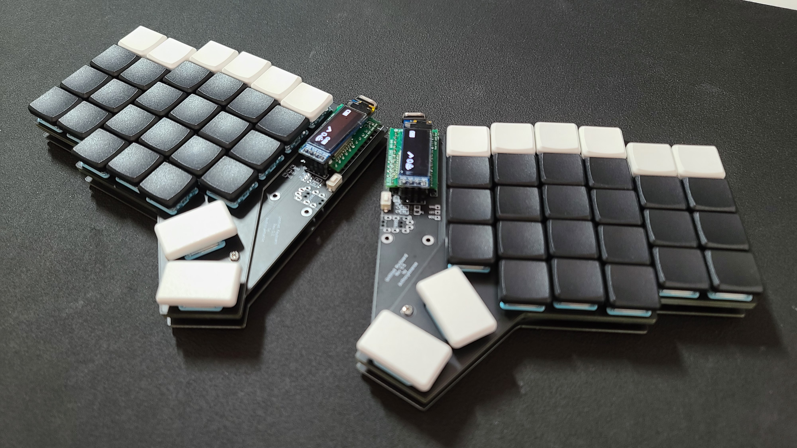
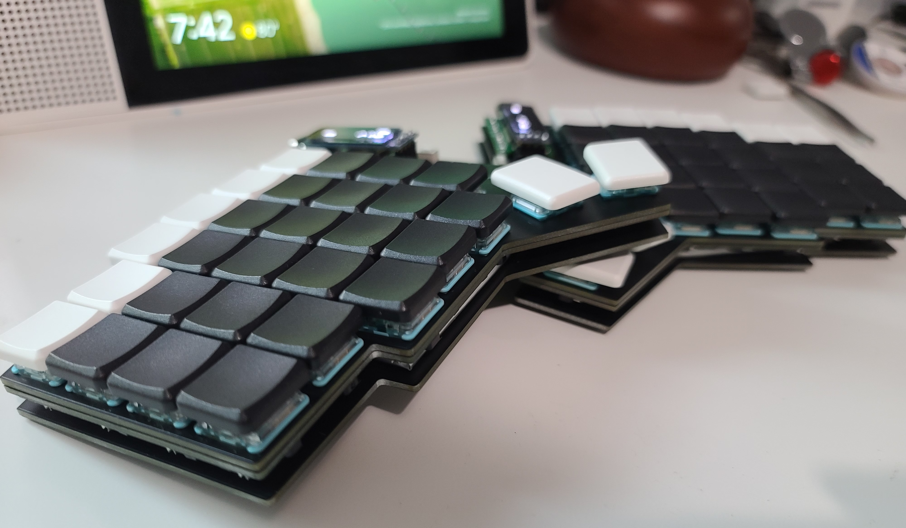
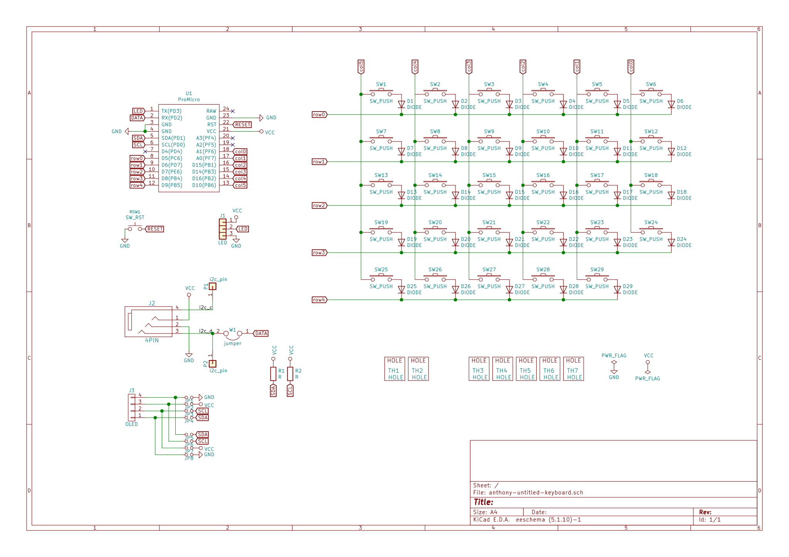

# Untitled Keyboard

This is a choc only wireless split keyboard with pro micro compatible sockets. It's inspired by the Sofle, Lily58, Corne, ... keyboards. It has Kailh choc spacings (18 mm x 17 mm). Keycaps I'm using are MBK choc keycaps which has a size of 17.5 x 16.5. I didn't add support for encoder to make it a bit lighter. Pinky columns has a 0.5u vertical offset to make it more comfortable (at least for me). Bottom row has 2 x 1.5u keys with an angle. I thought this would make the thumb cluster more comfortable and reachable. In my experience with this keyboard, the thumb keys are more comfortable when the keyboard is tented. OLED is supported as well - make sure you have a big battery as it consumes a lot of power. I'm using 2000 mAh. This should last me 3-4 weeks based on [ZMK's power profiler](https://zmkfirmware.dev/power-profiler).

The pro micro socket has a bit more width spacing to support the bluemicro840's 20mm width. I've only tested this keyboard with ZMK firmware but it should work for QMK as well since I've put in a slot for the TRRS jacks. Keyboard doesn't have a name so feel free to remove or change the silkscreen on the PCB!

## Photos

## Build log/guide

1. [Materials](docs/materials.md)
2. [Building the Keyboard](docs/buildguide.md)
3. [Firmware](docs/firmware.md)