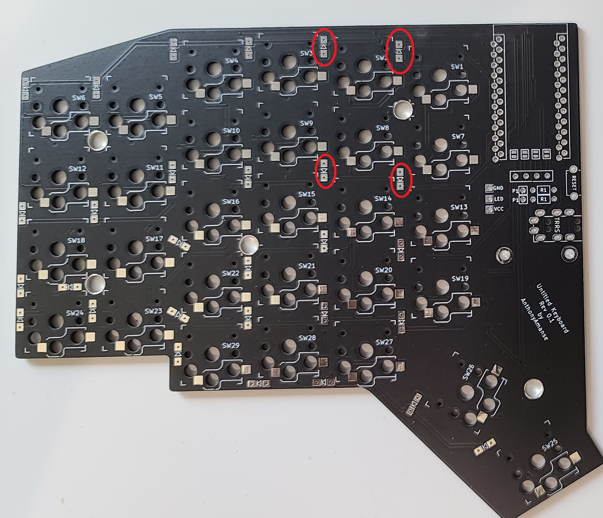

# Build guide

The build process is mostly similar to the Sofle, Lily58, Corne keyboards.

Link to the bill of materials:
[materials](materials.md)

## Table of Contents

1. [Identify left and right PCBs](#1-identify-left-and-right-pcbs)
2. [Soldering the Diodes](#2-Soldering-the-Diodes)
3. [Soldering the Kailh Choc Hot swap sockets](#3-Soldering-the-Kailh-Choc-Hot-swap-sockets)
4. [Soldering the reset switch](#4-Soldering-the-reset-switch)
5. [Bridge pads for OLED](#5-Bridge-pads-for-OLED)
6. [Solder the pin headers](#6-Solder-the-pin-headers)
7. [Socket the microcontroller](#7-socket-the-microcontroller)
8. [Putting the switch plates](#8-Putting-the-switch-plates)
9. [Solder battery wires](#9-Solder-battery-wires)
10. [Putting the bottom plates](#10-Putting-the-bottom-plates)

#### 1. Identify left and right PCBs

The PCBs are reversible so you can use either for left and right. You will need to choose which one will be your left and right side. Then, take note or mark which one is your front and back on both sides of the keyboard.

#### 2. Soldering the Diodes
(BACK of the PCB)

There are 29 diodes for each side. The diodes will be soldered at the back of the pcb. **Orientation matters for the diode**. The diagram below shows the correct position for your diode.

An easy way to solder SMD diodes is to solder one pad first (without the diode). Then place the diode and heat up the pad. That would stick one of the sides of the diode, then you can easily add solder to the other side of the diode.

#### 3. Soldering the Kailh Choc Hot swap sockets
(BACK of the PCB)

Orientation doesn't matter here but make sure they are placed at the back of your PCB - same as your diodes. Use the same technique from the previous step to easily solder in place. There are 29 sockets for each side.

#### 4. Soldering the reset switch
(FRONT of the PCB)

The reset switch should face in front of the pcb. Place the switch in its place and you can solder the pins from the back.

#### 5. Bridge pads for OLED
(FRONT of the PCB)

To use an OLED, create a bridge between these pads below. Make sure you do this in the FRONT side of your pcb.

<!-- https://github.com/qmk/qmk_firmware/issues/7522 -->

#### 6. Solder the pin headers
(FRONT of the PCB)

The pin heades should be in front of the PCB. First, you will need to identify which of the 1x12 pinouts you will use. The image below shows which is the raw pinout. In my case, I used the columns with the red circle since I wanted my bluemicro840s to face up.

#### 7. Socket the microcontroller

[Tips on how to socket a microcontroller](https://docs.splitkb.com/hc/en-us/articles/360011263059-How-do-I-socket-a-microcontroller-)

After socketing the microcontroller, de-attach it from the pcb before installing the battery.

#### 8. Putting the switch plates

You can now add the switch plate. You can use 5 switches initially to align and secure the switch plate to the PCB. Then proceed in installing all of them.

After securing the switch plate to the PCB, add the M2 spacers and screw them in the switch plate.

> You can omit the spacer in the middle to make space for your battery if it's big.

#### 9. Solder battery wires
(BACK of the PCB)

You will need attach a battery to use it wirelessly. Solder the RED wire to the RAW pin. The black wire to one of the GROUND pins. Using the image guide in Step 6, you can see where the RAW pinout is. Image below is how I have them set up.

> Make sure you don't have your microcontroller attached in your sockets to avoid short circuits.

#### 10. Putting the bottom plates

Screw in the M2 screws, add adhesive feet and you're done! Re-attach your microcontroller and you can now flash the ZMK firmware: [firmware.md](firmware.md)

